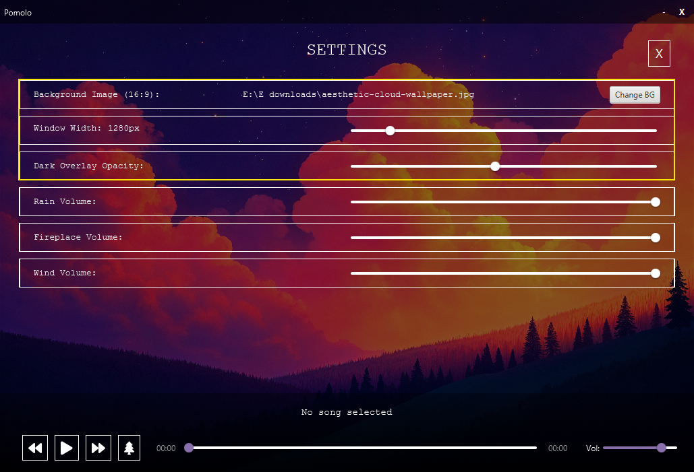
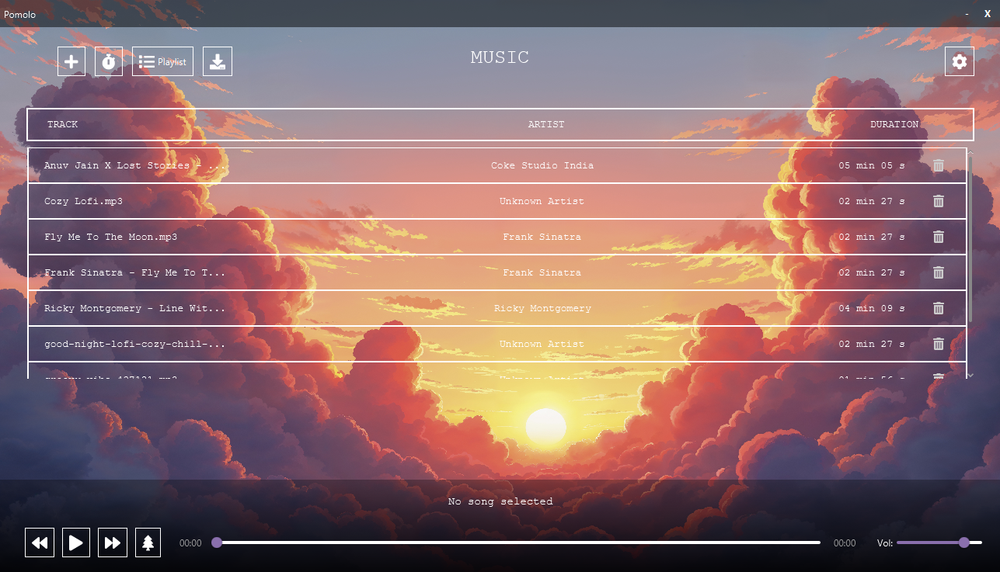
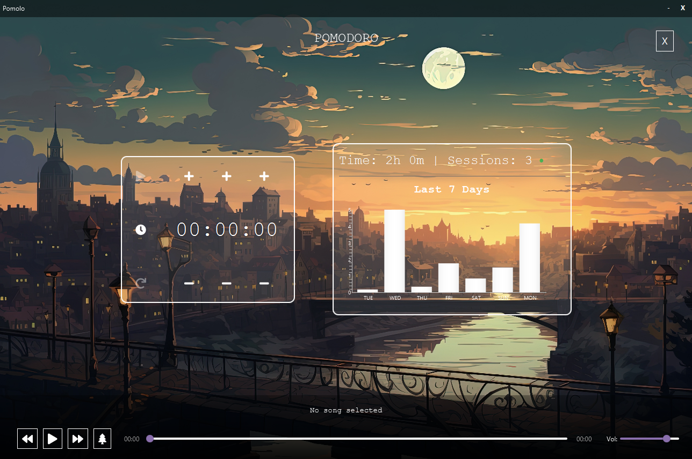
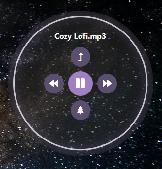
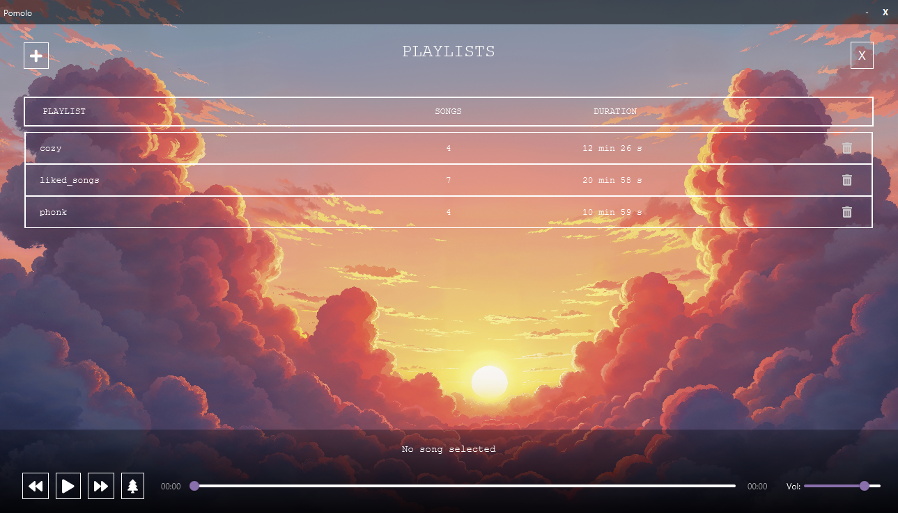
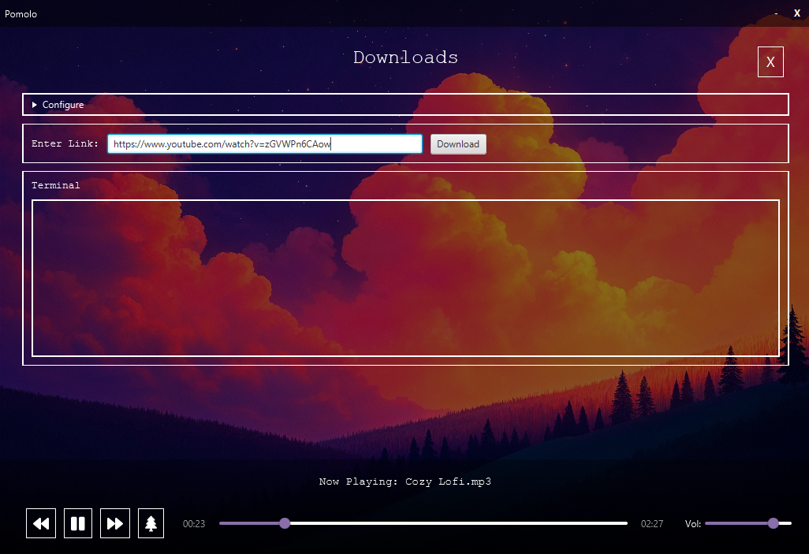

# 🌟Pomolo

Pomolo is a minimalist lofi music player–productivity app that lets users enjoy relaxing music with downloadable tracks, a smooth floating miniplayer, and tools to stay focused while tracking their progress through detailed statistics.

---

# ✨ Features

## 1. 🎨 Customizable UI

Customizable backgrounds, adjustable app window size, and black overlay opacity for perfect brightness control.

 

---

## 2. 🍅 Pomodoro Timer & Focus Statistics

Pomodoro timer for focused sessions, with weekly statistics to track and analyze user productivity. 

---

## 3. 🎵 Cozy Miniplayer

Minimalist floating miniplayer with smooth animations, allowing music control without interrupting your workflow.

---

## 4. 🎶 Playlist System

Custom playlist system for organizing music according to different moods and tastes, including a dedicated liked songs playlist. 

---

## 5. ⬇️ Download Music

Download tracks directly for offline listening using yt-dlp or ffmpeg. 

---

## 6. 🎚️ Ambient Sound Mixer

Ambient sound mixer with rain, wind, and fireplace sounds to enhance focus and productivity. 

---

# 👥 Contributers

| Name           
| -------------- 
| **Sazid Alam**  
| **Khaza Asif** 
| **Sakib Mujbain Sadat** 
| **Faiaz Ibne Iqbal** 

