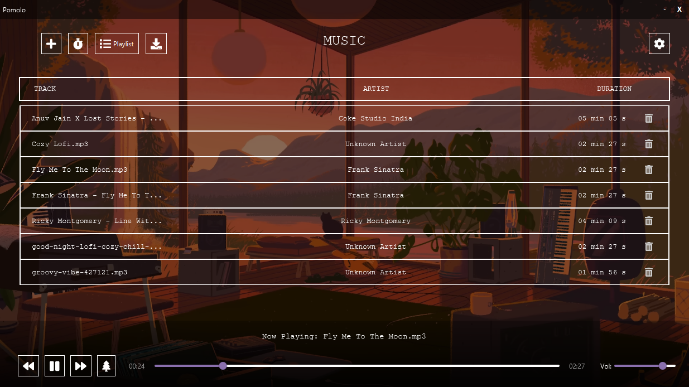
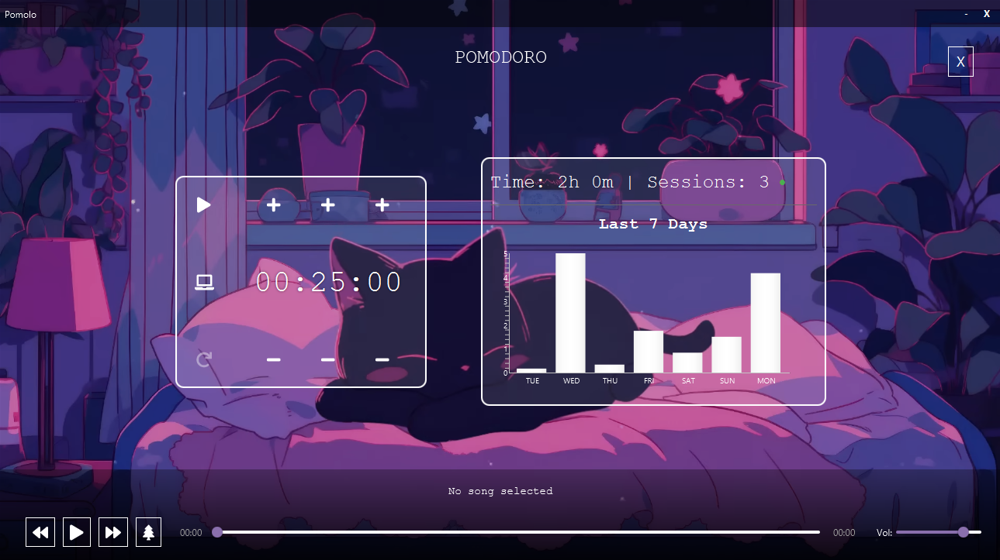
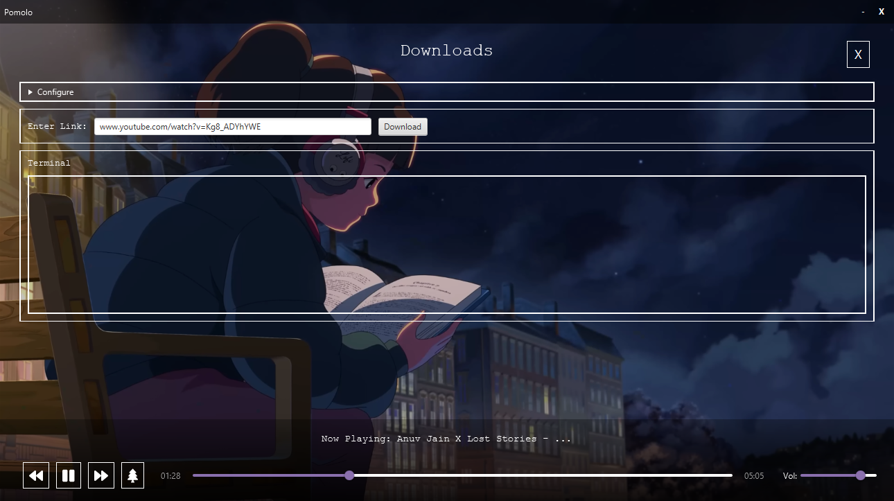
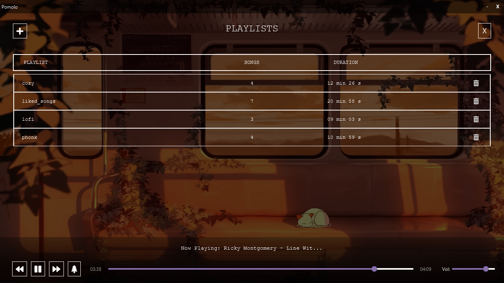

# Pomolo

A minimalist lofi music player built for focus and productivity

---

#  Releases

| Platform       | Download                                                                               |
| -------------- | -------------------------------------------------------------------------------------- |
| **Windows** | [Download (.exe)](https://github.com/your-username/pomolo/releases/latest)             |
| **MacOS**   | [Download (.dmg)](https://github.com/your-username/pomolo/releases/latest)             |
| **Linux**   | [Download (.AppImage / .deb)](https://github.com/your-username/pomolo/releases/latest) |

---

# Screenshots

  
  

  
  

---

# Features

* Fully Customizable UI with adjustable dark overlay opacity, window size, and backgrounds(Gifs/Photos).
* Built-in Pomodoro timer with weekly statistics and session tracking.
* Playlist feature to organize tracks.
* Cozy floating miniplayer with smooth animations.
* Ambient sound mixer that blends rain, wind, fireplace sounds with the music.
* Smooth music management allowing seamless addition, import, and downloading of tracks.

